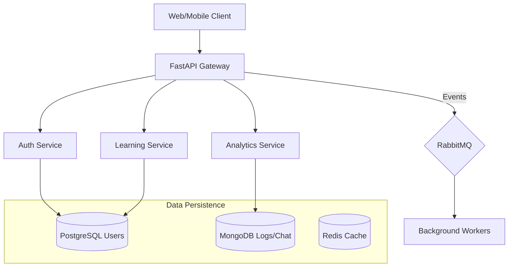

# Sepnoty Learning & Career Platform - Backend System

> **A scalable, event-driven backend platform for learning management and career analytics.**  
> Designed & Engineered by **Sabbisetti Naga Sai Ayyappa Bhaskar**  
> *Senior Backend Engineer / AI Engineer Portfolio*

---

## 🏗️ System Architecture

This project demonstrates a production-grade **Clean Architecture** utilizing a **Hybrid Database** strategy (SQL + NoSQL).



### 🚀 Key Technical Decisions (Interview Analysis)

| Component | Choice | Why this choice? |
|-----------|--------|------------------|
| **Framework** | **FastAPI** | High-performance (async), automatic OpenAPI docs, and strict typing with Pydantic. |
| **Database (Relational)** | **PostgreSQL** | ACID compliance for critical data (Payments, Enrollments, Users). |
| **Database (NoSQL)** | **MongoDB** | High write throughput for Activity Logs, Audit Trails, and Chat History. |
| **Caching** | **Redis** | Sub-millisecond session storage and API response caching to reduce DB load. |
| **Async Tasks** | **RabbitMQ** | Decoupled event-driven architecture for robust email notifications and certificate generation. |
| **Security** | **JWT + OAuth2** | Stateless authentication scaling universally across microservices. |

---

## 🛠️ Technology Stack

-   **Language**: Python 3.13 (Async I/O)
-   **API**: FastAPI, GraphQL (Graphene)
-   **Databases**: PostgreSQL (AsyncPG), MongoDB (Motor), Redis
-   **ORM**: SQLAlchemy 2.0 (Async), Alembic (Migrations)
-   **Security**: OAuth2, JWT, Bcrypt, RBAC

**Frontend:**
-   **Framework**: React 18 + Vite + TypeScript
-   **Styling**: Tailwind CSS v4 + Lucide React
-   **State**: Zustand
-   **Networking**: Axios (Interceptors)

---

## 📂 Project Structure (Clean Architecture)

```
app/
 ├── api/           # Presentation Layer (Routes, Dependencies)
 ├── services/      # Business Logic (Use Cases)
 ├── repositories/  # Data Access Layer (Abstracts DB)
 ├── models/        # Domain Entities (SQLAlchemy)
 ├── schemas/       # Data Transfer Objects (Pydantic)
 ├── core/          # Infrastructure (Config, Security, Logging)
 ├── db/            # Database Connections
 └── main.py        # Application Entry Point
```

This structure ensures **Separation of Concerns**, making the codebase highly testable and maintainable.

---

## ⚡ Features Implemented

-   ✅ **Authentication System**: Secure Signup/Login with Bcrypt hashing and JWT tokens.
-   ✅ **Role-Based Access**: Support for Student, Instructor, and Admin roles.
-   ✅ **Hybrid Database Connection**: Simultaneous Async connections to Postgres and Mongo.
-   ✅ **Automated Migrations**: Alembic setup for database schema versioning.
-   ✅ **Centralized Config**: Pydantic Settings for environment management.

---

## 🔧 Getting Started

### Prerequisites
-   Python 3.10+
-   PostgreSQL & MongoDB running
-   Redis (Optional for now)

### Installation

1.  **Clone the repository**
2.  **Install Dependencies**:
    ```bash
    pip install -r requirements.txt
    ```
3.  **Environment Setup**:
    Copy `.env.example` to `.env` and configure your database credentials.
4.  **Run Migrations**:
    ```bash
    alembic upgrade head
    ```
5.  **Start Server**:
    ```bash
    uvicorn app.main:app --reload
    ```
    Access docs at: `http://localhost:8000/docs`

---

## 🧪 Testing

Run the verification script to test the full auth flow:
```bash
python verify_backend.py
```
